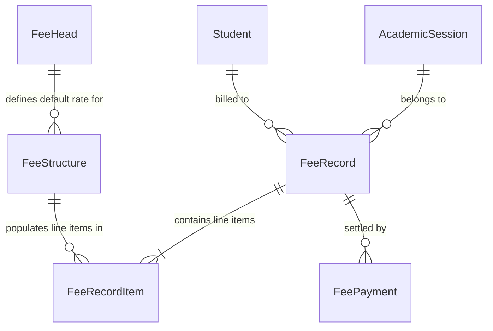
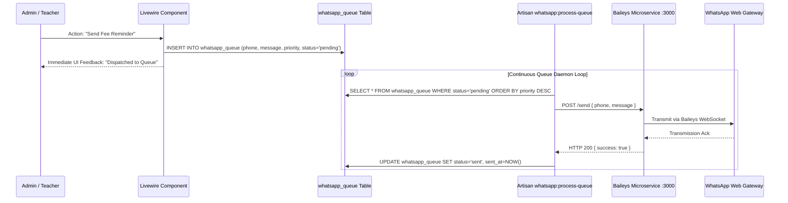
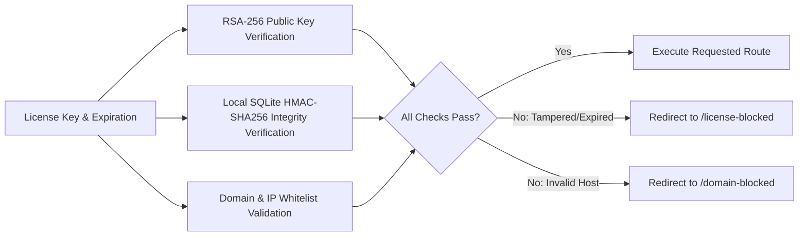
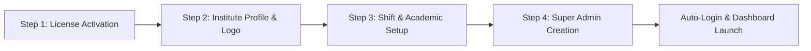
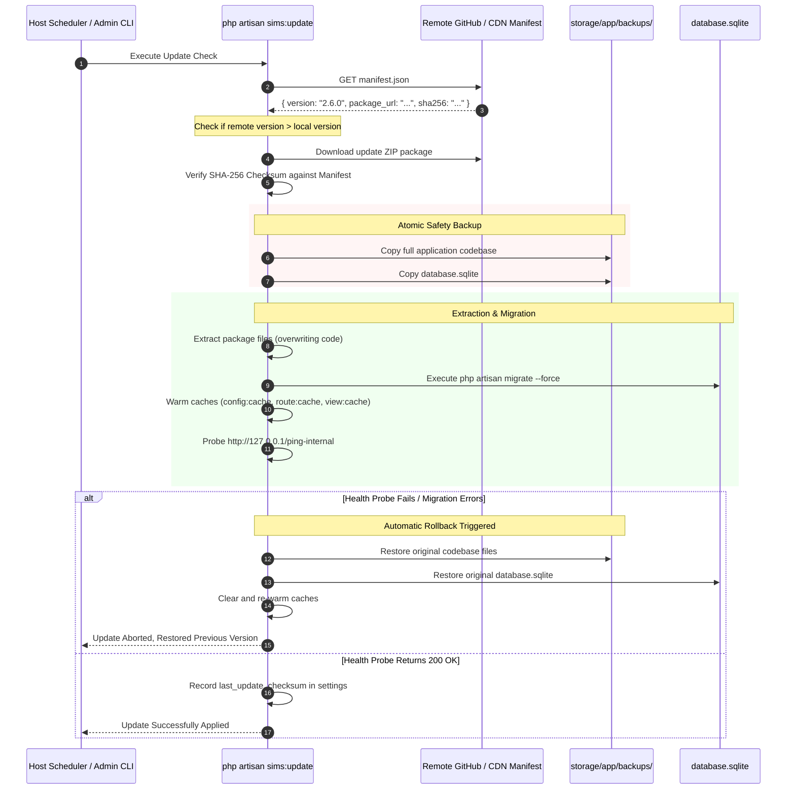

# School Information Management System (SIMS)
## Comprehensive Technical Analysis & System Architecture Report

> **Document Version:** 2.5.0  
> **Target System:** SIMS Production Deployment  
> **Core Framework:** Laravel 12.x | Livewire 3.7+ | Alpine.js 3.4+ | Tailwind CSS 3.x / DaisyUI  
> **Server Runtime:** FrankenPHP (Caddy engine) / Portable PHP 8.2+ NTS  
> **Database:** SQLite with Write-Ahead Logging (WAL) / MySQL Optional  
> **Status:** Production Ready (146 Automated Feature Tests Passing)

---

## Table of Contents

1. [Executive Summary & Product Vision](#1-executive-summary--product-vision)
2. [End-to-End System Architecture](#2-end-to-end-system-architecture)
3. [Technology Stack & Runtime Dependencies](#3-technology-stack--runtime-dependencies)
4. [Standalone Zero-Dependency Deployment Model](#4-standalone-zero-dependency-deployment-model)
5. [Core Subsystems Technical Deep-Dive](#5-core-subsystems-technical-deep-dive)
   - [5.1 Dual-Context Academic Session & Shift Shifter](#51-dual-context-academic-session--shift-shifter)
   - [5.2 Student Lifecycle, Enrollment & Promotion Engine](#52-student-lifecycle-enrollment--promotion-engine)
   - [5.3 Financial & Fee Management Subsystem](#53-financial--fee-management-subsystem)
   - [5.4 Timetabling & Intelligent Daily Teacher Substitution](#54-timetabling--intelligent-daily-teacher-substitution)
   - [5.5 Examination, Datesheet & Marks Grading Engine](#55-examination-datesheet--marks-grading-engine)
   - [5.6 Granular RBAC & Feature Sharing Architecture](#56-granular-rbac--feature-sharing-architecture)
   - [5.7 WhatsApp Notification Queue & Microservice Gateway](#57-whatsapp-notification-queue--microservice-gateway)
6. [Security, Cryptographic Licensing & Anti-Tampering Engine](#6-security-cryptographic-licensing--anti-tampering-engine)
7. [First-Run Setup Gatekeeper & Guided In-App Product Tour](#7-first-run-setup-gatekeeper--guided-in-app-product-tour)
8. [Automated Self-Update & Atomic Rollback Pipeline](#8-automated-self-update--atomic-rollback-pipeline)
9. [Database Entity Schema & Data Dictionary](#9-database-entity-schema--data-dictionary)
10. [Route Matrix & Security Endpoint Catalog](#10-route-matrix--security-endpoint-catalog)
11. [Host Process Supervisor & CLI Command Catalog](#11-host-process-supervisor--cli-command-catalog)
12. [Testing, Quality Assurance & Validation Baseline](#12-testing-quality-assurance--validation-baseline)
13. [Architectural Findings, Observations & Recommendations](#13-architectural-findings-observations--recommendations)

---

## 1. Executive Summary & Product Vision

The **School Information Management System (SIMS)** is an enterprise academic administration and institutional resource planning system designed specifically for primary, secondary, and higher secondary educational institutions.

### Primary Objectives & Target Use Cases
- **Consolidated Academic Operations**: Unifies student enrollment, multi-shift scheduling, daily teacher substitutions, examinations, grade reporting, fee billing, and parent communication into a single unified platform.
- **Zero-Dependency Client Deployment**: Solves the traditional barrier of complex software deployments (Nginx, Apache, PHP extensions, Redis, Node daemons) by packaging everything into a portable, self-contained bundle for standard desktop PCs or institutional servers.
- **Dual-Shift Multi-Tenancy**: Supports institutions operating distinct morning, evening, and regular shifts within single or multiple academic years.
- **Secure Commercial Distribution**: Incorporates remote asymmetric RSA-256 license authentication, local SQLite HMAC-SHA256 anti-tamper safeguards, and tiered feature/resource gating.

---

## 2. End-to-End System Architecture

SIMS employs a single-page reactive architecture powered by **Laravel 12** and **Livewire 3**, served by **FrankenPHP** with native HTTPS, backed by **SQLite** configured for multi-process concurrency.

### High-Level System Architecture Diagram

```mermaid
graph TB
    subgraph ClientLayer [Client & Institutional Devices]
        AdminBrowser[School Admin Desktop / Laptop]
        TeacherBrowser[Teacher Tablet / Mobile Web]
        ParentBrowser[Parent Public Digital Voucher]
    end

    subgraph HostSupervisor [Host Operating System Services]
        TaskSched[Windows Task Scheduler / Linux systemd]
        RunnerWeb[bin/run-web.bat :80 & :443]
        RunnerQueue[bin/run-queue.bat]
        RunnerCron[bin/run-scheduler.bat]
        TaskSched --> RunnerWeb
        TaskSched --> RunnerQueue
        TaskSched --> RunnerCron
    end

    subgraph WebServer [FrankenPHP / Caddy Server Layer]
        Caddy[Caddyfile Reverse Proxy & TLS Engine]
        RunnerWeb --> Caddy
        Caddy --> HTTPPort[Port 80 HTTP Redirect]
        Caddy --> HTTPSPort[Port 443 HTTPS Internal TLS]
        HTTPSPort --> LaravelApp[Laravel 12 Application Kernel]
    end

    subgraph SecurityGateways [Security & Verification Middlewares]
        LaravelApp --> InstalledGate[EnsureAppInstalled Gatekeeper]
        InstalledGate --> LicenseGate[VerifyLicense RSA & Integrity Filter]
        LicenseGate --> AuthRBAC[Auth & Spatie RBAC Filter]
        AuthRBAC --> ShiftContext[SessionShifter Academic Context]
    end

    subgraph BusinessSubsystems [Core Reactive Livewire Subsystems]
        ShiftContext --> SubA[Academic Sessions & Shifts]
        ShiftContext --> SubB[Student Registry & Enrollment]
        ShiftContext --> SubC[Fee Billing & Ledger Engine]
        ShiftContext --> SubD[Timetable & Substitution Engine]
        ShiftContext --> SubE[Exams, Datesheets & Grading]
        ShiftContext --> SubF[Granular Feature Sharing]
        ShiftContext --> SubG[WhatsApp Communication Hub]
    end

    subgraph PersistenceLayer [Data & Storage Tier]
        DB[(SQLite WAL Database / database.sqlite)]
        FileStore[Storage Directory / Public Assets / PDF Cache]
        SubA & SubB & SubC & SubD & SubE & SubF & SubG --> DB
        SubC --> FileStore
    end

    subgraph ExternalServices [External Integrations & Background Daemons]
        RunnerQueue --> WAQueueCmd[php artisan whatsapp:process-queue]
        WAQueueCmd --> WABridge[Node.js Baileys Bridge :3000]
        WABridge --> WhatsAppNet[WhatsApp Web Network]
        LicenseGate -.-> FirebaseLicensing[Firebase Remote License Server]
        ParentBrowser -.-> GuestRoute[/v/{token} Public Voucher PDF]
    end
```

---

## 3. Technology Stack & Runtime Dependencies

### 3.1 Backend Architecture
- **Language Runtime:** PHP 8.2+ / 8.3+ (Bundled Portable NTS x64 on Windows).
- **Core Framework:** Laravel 12.0+ (utilizing strict typed properties, modern service containers, and modular routing).
- **Reactive Engine:** Livewire 3.7+ with Alpine.js 3.4+ (eliminating the need for a separate SPA build or frontend API layer).
- **Authorization Engine:** `spatie/laravel-permission` 6.24+ extended with dynamic session-scoped feature delegation.
- **Document Engine:** `barryvdh/laravel-dompdf` 3.1+ (producing pixel-accurate printable fee bills, result cards, and substitution slips).

### 3.2 Frontend Architecture
- **CSS Framework:** Tailwind CSS 3.1+ with `@tailwindcss/forms` plugin.
- **Component System:** DaisyUI 3.x combined with custom Glassmorphism UI tokens.
- **Client Scripting:** Alpine.js 3.4+ for modal transitions, client-side filtering, and micro-interactions.
- **Date Pickers:** Flatpickr 4.6.13.
- **Guided Tours:** Driver.js embedded in the master administrative layout.

### 3.3 Concurrency & Storage Profile
- **Default Database:** SQLite 3 with Write-Ahead Logging (WAL):
  ```php
  'sqlite' => [
      'driver' => 'sqlite',
      'database' => env('DB_DATABASE', database_path('database.sqlite')),
      'busy_timeout' => 5000,
      'journal_mode' => 'WAL',
      'synchronous' => 'NORMAL',
      'transaction_mode' => 'DEFERRED',
      'foreign_key_constraints' => true,
  ]
  ```
- **Session, Cache & Queue:** Decoupled from Redis and driven by the database engine (`CACHE_STORE=database`, `QUEUE_CONNECTION=database`, `SESSION_DRIVER=database`). This eliminates port 6379 conflicts, background Redis daemon failures, and PHP Redis extension dependencies.

---

## 4. Standalone Zero-Dependency Deployment Model

A key design innovation in SIMS is its **100% self-contained portable architecture**. Client institutions do not need to install web servers, runtimes, or database engines.

### 4.1 Comparison: Traditional Web App vs. SIMS Standalone

| Component | Traditional Web Application | SIMS Production Standalone | Benefit to Institution |
|---|---|---|---|
| **Web Server** | Nginx or Apache HTTPD | **FrankenPHP single binary** | Zero configuration files; native HTTP/HTTPS out of the box. |
| **Process Daemon** | PM2 or Supervisord | **Windows Task Scheduler / Linux systemd** | Uses pre-installed native OS tools; auto-boots on machine restart. |
| **Caching & Queue** | Redis (`redis-server`) | **Database driver on SQLite (WAL)** | Zero RAM footprint overhead; zero port conflicts; no Redis crashes. |
| **Node.js Process** | Node.js + NPM server | **Pre-compiled production assets** | Client PC runs zero Node.js processes. |
| **PHP Runtime** | Globally installed PHP + extensions | **Bundled Portable PHP 8.2 NTS (`runtime/php/`)** | Isolation from other software on the machine. |

### 4.2 Automated 1-Click Installer (`install.bat` / `install.sh`)
The root installer script provides a turn-key experience on client machines:
1. **Administrative Elevation**: Automatically prompts for UAC elevation if launched without administrator privileges.
2. **Port Conflict Remediation**: Detects if Windows IIS (`W3SVC`) is running on port 80 and safely stops/disables it.
3. **Network ACL & Firewall Configuration**:
   - Executes `netsh http add urlacl url=http://+:80/ user=Everyone`
   - Executes `netsh http add urlacl url=https://+:443/ user=Everyone`
   - Registers inbound TCP firewall rules for ports 80 and 443.
4. **Artisan Bootstrap**: Runs `php artisan sims:install`, generating an AES-256 master `APP_KEY`, ensuring `database.sqlite` exists, running database migrations silently, and warming caches.
5. **Supervisor Registration**: Registers 3 scheduled tasks in Windows Task Scheduler:
   - `SIMS-Web`: FrankenPHP server serving `:80` and `:443`.
   - `SIMS-Queue`: Queue daemon for background jobs.
   - `SIMS-Scheduler`: Scheduler ticking every 60 seconds.
6. **Port Polling & Browser Launch**: Polls port 80 until FrankenPHP is live, then launches the default browser to `http://localhost`.

---

## 5. Core Subsystems Technical Deep-Dive

### 5.1 Dual-Context Academic Session & Shift Shifter

#### Context Model
Schools often operate multiple concurrent academic sessions (e.g., ongoing academic year vs. new enrollment year) and multiple shifts (Morning, Evening, Regular).

```
Academic Session (ID: 1, Name: "2025-2026", Shift Model: "Dual")
├── Morning Context (Class 9-A Morning, Morning Fee Structures, Morning Timetable)
└── Evening Context (Class 9-A Evening, Evening Fee Structures, Evening Timetable)
```

#### Technical Implementation
- **Component:** [`app/Livewire/SessionShifter.php`](file:///d:/SIMS-Production/sims-app/sims-app/app/Livewire/SessionShifter.php)
- **State Storage:** Persisted in HTTP session under `selected_academic_session_id` and `selected_shift_type`.
- **Global Helper:** `AcademicSession::getActiveSessionId()` respects administrator session overrides, falling back to database default.
- **Model Scoping:**
  - `Classes`: Filtered by `academic_session_id` and `shift_type`.
  - `Enrollments`: Links `Student` to `Class`, `AcademicSession`, and `shift_type`.
  - `FeeStructures`, `Timetables`, `PeriodConfigs`, and `TeacherAttendances`: Scoped to the active session and active shift context.

---

### 5.2 Student Lifecycle, Enrollment & Promotion Engine

#### Technical Implementation
- **Components:**
  - [`StudentManager.php`](file:///d:/SIMS-Production/sims-app/sims-app/app/Livewire/Admin/StudentManager.php) (52 KB logic, 105 KB Blade template).
  - [`StudentImportManager.php`](file:///d:/SIMS-Production/sims-app/sims-app/app/Livewire/Admin/StudentImportManager.php) (CSV import pipeline with field mapping and validation).
  - [`AcademicSessionManager.php`](file:///d:/SIMS-Production/sims-app/sims-app/app/Livewire/Admin/AcademicSessionManager.php) (Promotion and transition pipeline).

#### Key Capabilities
- **Decoupled Architecture:** Separates the physical `Student` identity (CNIC/B-Form, father details, blood group, medical info) from the `Enrollment` record (class, section, roll number, session, shift).
- **Auto Roll Number Generator:** Intelligently computes the next sequential roll number within a specific class, section, session, and shift to prevent duplicate roll numbers.
- **Bulk Data Operations:** Inline editing of student data, bulk shift transfer, and batch enrollment status changes.
- **Promotion Pipeline:** Seamlessly advances entire cohorts to their respective `next_class_id` when closing an academic session, retaining historical academic records in past enrollments.

---

### 5.3 Financial & Fee Management Subsystem

The Fee Engine manages the full institutional financial lifecycle from tuition rate definition to receipt generation.



#### Core Components
1. **Fee Structures ([`FeeStructure.php`](file:///d:/SIMS-Production/sims-app/sims-app/app/Models/FeeStructure.php))**: Defines tuition, admission, examination, and computer lab fees per class, session, and shift.
2. **Batch Invoice Generator ([`InvoiceGenerator.php`](file:///d:/SIMS-Production/sims-app/sims-app/app/Livewire/Admin/Fee/InvoiceGenerator.php))**:
   - Generates batch fee records for entire classes or selected students.
   - Enforces unique constraints to prevent duplicate invoicing for the same student within the same billing month and session.
3. **Payment Collection & Real-Time Ledger ([`RecordPayment.php`](file:///d:/SIMS-Production/sims-app/sims-app/app/Livewire/Admin/Fee/RecordPayment.php) / [`StudentLedger.php`](file:///d:/SIMS-Production/sims-app/sims-app/app/Livewire/Admin/Fee/StudentLedger.php))**:
   - Supports partial, exact, and excess (advance) payments.
   - Dynamically calculates outstanding dues across unpaid invoices:
     $$\text{Balance Due} = \sum(\text{FeeRecordItems.amount}) - \sum(\text{FeePayments.amount\_paid})$$
4. **Public Guest Vouchers ([`PublicVoucherController.php`](file:///d:/SIMS-Production/sims-app/sims-app/app/Http/Controllers/PublicVoucherController.php))**:
   - Every invoice generates a 64-character unguessable cryptographic token (`access_token`).
   - Parents access digital responsive challan forms at `/v/{token}` and download DomPDF copies at `/v/{token}/pdf` without requiring portal login credentials.
5. **Defaulter Analytics & Multi-Format Reporting ([`DefaulterList.php`](file:///d:/SIMS-Production/sims-app/sims-app/app/Livewire/Admin/Fee/DefaulterList.php))**:
   - Computes aggregated balance dues across classes and shifts.
   - Features direct Excel export (HTML tab-separated data), CSV stream export (RFC 4180 compliant), and institutional print layout with school letterhead.

---

### 5.4 Timetabling & Intelligent Daily Teacher Substitution

One of the platform's standout modules is the automated substitute teacher recommendation engine.

#### Period Configuration & Schedule Grid
- **Period Config ([`PeriodConfigManager.php`](file:///d:/SIMS-Production/sims-app/sims-app/app/Livewire/Admin/PeriodConfigManager.php))**: Sets daily period start/end times, assembly slots, recess periods, and total daily periods per shift.
- **Master Timetable ([`ScheduleManager.php`](file:///d:/SIMS-Production/sims-app/sims-app/app/Livewire/Admin/ScheduleManager.php))**: Coordinates teacher assignments across classes, subjects, rooms, and weekdays (Monday through Saturday).

#### Daily Substitution Algorithm ([`SubstitutionManager.php`](file:///d:/SIMS-Production/sims-app/sims-app/app/Livewire/Admin/SubstitutionManager.php))
1. **Attendance Ingestion**: Checks daily teacher attendance records (`teacher_attendances` table) for the selected date and shift.
2. **Absence Identification**: Automatically detects teachers marked as *Absent* or *On Leave*.
3. **Slot Conflict Analysis**: Loops through each scheduled period taught by the absent teacher on that weekday.
4. **Availability Matching**:
   - Scans all active faculty members in the same shift.
   - Filters out teachers already scheduled to teach during that specific period.
   - Filters out teachers already assigned as substitutes for another absent teacher in that same period.
5. **Recommendation & Override**: Displays the prioritized list of available free teachers with toggle override to assign any teacher if needed.
6. **Printable Substitution Sheet**: Generates a clean, print-ready daily substitution sheet (`/admin/substitutions/print`) for morning staff notification.

---

### 5.5 Examination, Datesheet & Marks Grading Engine

#### Workflow
1. **Exam Definitions ([`ExamManager.php`](file:///d:/SIMS-Production/sims-app/sims-app/app/Livewire/Admin/ExamManager.php))**: Configures institutional examinations (Midterm, Final Term, Monthly Tests) bound to academic sessions and classes.
2. **Datesheet Generator ([`DatesheetManager.php`](file:///d:/SIMS-Production/sims-app/sims-app/app/Livewire/Admin/Datesheet/DatesheetManager.php))**: Schedules exam slots (date, start time, end time, room, syllabus instructions) for each subject and class. Produces printable datesheets for student distribution.
3. **Marks Entry & Grading Rules ([`MarksConfig.php`](file:///d:/SIMS-Production/sims-app/sims-app/app/Models/MarksConfig.php) / [`GradeManager.php`](file:///d:/SIMS-Production/sims-app/sims-app/app/Livewire/Admin/GradeManager.php))**:
   - Configures maximum marks, passing marks, and percentage thresholds.
   - Supports flagging students as *Absent* or *Exempt*, adjusting calculations accordingly.
4. **Grade Locks ([`grade_locks` table](file:///d:/SIMS-Production/sims-app/sims-app/database/migrations/2025_12_27_000004_create_grade_locks_table.php))**: Enables administrators to lock examination results, preventing subsequent teacher edits.

---

### 5.6 Granular RBAC & Feature Sharing Architecture

SIMS implements a dual-layer access control system combining **Spatie Laravel-Permission** with a custom **Feature Sharing Engine** ([`FeatureSharingManager.php`](file:///d:/SIMS-Production/sims-app/sims-app/app/Livewire/Admin/AccessControl/FeatureSharingManager.php)).

```
┌────────────────────────────────────────────────────────┐
│                   Default Roles                         │
│  Super Admin / Admin         Teacher                   │
│  Full access to all modules   My Class, Attendance,     │
│                              My Timetable, Marks Entry │
└──────────────────────┬─────────────────────────────────┘
                       │
                       ▼ Delegated via Feature Sharing
┌────────────────────────────────────────────────────────┐
│        Delegated Module Execution (e.g. Fees)          │
│  Teacher accesses: /teacher/shared/fee/invoice-generator│
│  • Executes Admin InvoiceGenerator Livewire Component  │
│  • Renders seamlessly within Teacher Layout Navigation │
│  • Restricted strictly to assigned classes / shifts    │
└────────────────────────────────────────────────────────┘
```

#### Shared Execution Flow
- School administrators can delegate specific administrative capabilities (e.g., student management, fee generation, datesheet scheduling) to trusted teachers without promoting them to full system administrators.
- When a delegated teacher visits `/teacher/shared/*`, the system verifies granular permissions (`fees.manage`, `exams.manage`, `students.manage`) and instantiates the battle-tested Admin Livewire component rendered inside the teacher's navigation shell.

---

### 5.7 WhatsApp Notification Queue & Microservice Gateway

To eliminate blocking HTTP latency during web transactions, SIMS uses an asynchronous database queue architecture for WhatsApp notifications.



#### WhatsApp Dashboard ([`WhatsAppSetup.php`](file:///d:/SIMS-Production/sims-app/sims-app/app/Livewire/Admin/WhatsAppSetup.php))
- **Live Health & Pairing:** Displays connection health, QR code pairing, and phone pairing code generator.
- **Queue Manager:** Live monitoring of pending, sent, and failed messages with manual retry, force dispatch, and batch purging.
- **Template Placeholder Interpolation:** Dynamically parses placeholders:
  `{student_name}`, `{father_name}`, `{roll_no}`, `{class_name}`, `{amount}`, `{due_date}`, `{challan_link}`.

---

## 6. Security, Cryptographic Licensing & Anti-Tampering Engine

SIMS implements a defense-in-depth security model to ensure intellectual property protection and prevent unauthorized deployment tampering.

### 6.1 Three-Tier Verification Pipeline



#### 1. Remote Asymmetric RSA-SHA256 Signature
- License payloads generated by the master Firebase licensing server are signed using an RSA-256 private key.
- The client application verifies signatures locally using `public.pem` ([`LicenseVerifier.php`](file:///d:/SIMS-Production/sims-app/sims-app/app/Services/LicenseVerifier.php)):
  $$\text{Payload} = \text{licenseKey} \parallel \text{normalizedExpiresAt} \parallel \text{status}$$
- The private signing key never exists on client hardware.

#### 2. Local Database Tampering Protection (HMAC-SHA256)
- To prevent schools from modifying SQLite license expiry dates using SQLite tools, each stored record includes an HMAC-SHA256 signature calculated against the installation's secret key:
  $$\text{HMAC} = \text{hash\_hmac}('sha256', \text{licenseKey} \parallel \text{expiresAt} \parallel \text{status} \parallel \text{schoolId} \parallel \text{domains}, \text{APP\_KEY})$$
- Modifying a single bit in the SQLite database invalidates the HMAC and locks the application.

#### 3. Domain & IP Fencing
- Licenses can be restricted to specific authorized fully-qualified domain names or local IP ranges (`allowed_domains`), exempting standard local development addresses (`localhost`, `127.0.0.1`, `::1`).

### 6.2 Subscription Plans & Resource Limiting

The application defines 3 subscription tiers in [`config/plans.php`](file:///d:/SIMS-Production/sims-app/sims-app/config/plans.php):

| Feature / Resource Limit | Basic Plan | Standard Plan | Premium Plan |
|---|---|---|---|
| **Max Students** | 150 | 400 | **Unlimited** (`-1`) |
| **Max Teachers** | 10 | 25 | **Unlimited** (`-1`) |
| **Max Classes** | 5 | 15 | **Unlimited** (`-1`) |
| **Attendance & Timetable** | Included | Included | Included |
| **Exams, Datesheet & Grades** | Included | Included | Included |
| **Fee Management & Ledgers** | Excluded | Included | Included |
| **WhatsApp Notifications** | Excluded | Reminders Only | Full Suite (Vouchers, Digital Invoices) |
| **Custom Institute Branding** | Excluded | Excluded | Included |
| **Invoice Analytics** | Excluded | Excluded | Included |

### 6.3 License Lifecycle & Banner States

[`LicenseStatus.php`](file:///d:/SIMS-Production/sims-app/sims-app/app/Services/LicenseStatus.php) evaluates license status across 4 lifecycle stages:
1. **`active`**: Normal operation; full read/write access.
2. **`expiring_soon`**: Less than 14 days remaining; displays informational banner to administrators.
3. **`grace_period`**: Expired within 7-day grace window; read-only operations permitted (`canWrite() === false`), write operations disabled.
4. **`blocked`**: Expired beyond grace period, invalid signature, or tampered HMAC; intercepts all requests and redirects to `/license-blocked`.

---

## 7. First-Run Setup Gatekeeper & Guided In-App Product Tour

### 7.1 Setup Gatekeeper (`EnsureAppInstalled.php`)
Every incoming HTTP request passes through [`EnsureAppInstalled`](file:///d:/SIMS-Production/sims-app/sims-app/app/Http/Middleware/EnsureAppInstalled.php). If `app_installed` is `false` in the settings table:
- All system routes redirect to `/setup`.
- Internal probe routes (`/ping-internal`, `/setup`, `/license-blocked`) are exempt.
- Self-healing logic detects existing users if settings were somehow flushed, auto-recovering without re-running setup.

### 7.2 4-Step Setup Wizard (`SetupWizard.php`)



1. **Step 1: Cryptographic License Activation**: Accepts school license key (e.g. `SIMS-IMCB-1781541807190`), calls Firebase licensing API, validates RSA signature, and encrypts license in SQLite.
2. **Step 2: Institute Profile**: School name, contact details, address, and circular logo upload.
3. **Step 3: Academic Setup**: Shift model selection (Regular single shift vs. Dual morning/evening shifts), weekend schedule policy, and initial academic session name.
4. **Step 4: Super Admin Account**: Seeds Spatie permission roles, creates initial Super Admin account, marks `app_installed = true`, and logs the user in automatically.

### 7.3 Guided In-App Product Tour
- Upon initial login, a guided spotlight tour powered by **Driver.js** ([`tour.js`](file:///d:/SIMS-Production/sims-app/sims-app/resources/js/tour.js)) walks administrators through critical navigation items:
  1. Academic Session & Shift Shifter
  2. Student Management & Admissions
  3. Master Timetabling & Bell Period Configurations
  4. Daily Teacher Substitutions Engine
  5. Fee Invoicing & Ledger Records
  6. WhatsApp Communication Gateway
- Completing or dismissing the tour fires an asynchronous POST request to `/admin/tour/complete`, permanently clearing the first-run prompt.

---

## 8. Automated Self-Update & Atomic Rollback Pipeline

The platform includes an automated, atomic update pipeline implemented in [`SimsUpdate.php`](file:///d:/SIMS-Production/sims-app/sims-app/app/Console/Commands/SimsUpdate.php).

### Update Lifecycle Flow



---

## 9. Database Entity Schema & Data Dictionary

The application database includes **81 schema migration files** defining 25 core domain models:

### Core Tables & Entity Relationships

| Table Name | Primary Purpose | Key Foreign Keys & Associations |
|---|---|---|
| `users` | Administrator, teacher, and staff accounts | `class_id` |
| `students` | Demographic, parental, medical, and contact registry | Has many `Enrollment`, `FeeRecord` |
| `academic_sessions` | Institutional academic years & shift definitions | Has many `Enrollment`, `Classes` |
| `classes` | Class/grade definitions (e.g., 9th, 10th) | `academic_session_id`, `next_class_id` |
| `enrollments` | Student class assignments per session and shift | `student_id`, `class_id`, `academic_session_id` |
| `fee_heads` | Financial categories (Tuition, Admission, Exam Fee) | Has many `FeeStructure`, `FeeRecordItem` |
| `fee_structures` | Fee amounts per class, session, and shift | `fee_head_id`, `class_id`, `academic_session_id` |
| `fee_records` | Monthly student fee invoices | `student_id`, `academic_session_id`, `access_token` |
| `fee_record_items` | Itemized charges within a fee invoice | `fee_record_id`, `fee_head_id` |
| `fee_payments` | Transaction settlement ledger entries | `fee_record_id` |
| `exams` | Institutional examination events | `academic_session_id` |
| `exam_schedules` | Subject exam datesheet slots | `exam_id`, `class_id`, `subject_id` |
| `grade_locks` | Result finalization lock registry | `exam_id`, `class_id` |
| `marks_configs` | Maximum and passing marks configurations | `exam_id`, `class_id`, `subject_id` |
| `timetables` | Weekly master period schedule grid | `class_id`, `subject_id`, `teacher_id` |
| `period_configs` | Daily bell schedules per shift | `academic_session_id` |
| `teacher_attendances`| Daily teacher attendance records | `teacher_id`, `academic_session_id` |
| `whatsapp_queue` | Outbound message queue | `student_id` |
| `software_licenses` | RSA cryptographic license cache | Stores encrypted plan, expiry, HMAC |
| `settings` | System-wide and session-specific configuration | Key-value store with global/session scope |

---

## 10. Route Matrix & Security Endpoint Catalog

### 10.1 Public Guest Endpoints
- `GET /`: Redirects to `/login`.
- `GET /login`: System login view.
- `GET /setup`: 4-step first-run onboarding wizard ([`SetupWizard.php`](file:///d:/SIMS-Production/sims-app/sims-app/app/Livewire/Setup/SetupWizard.php)).
- `GET /v/{token}`: Public digital fee voucher view ([`PublicVoucherController@show`](file:///d:/SIMS-Production/sims-app/sims-app/app/Http/Controllers/PublicVoucherController.php)).
- `GET /v/{token}/pdf`: Printable PDF download for fee vouchers ([`PublicVoucherController@downloadPdf`](file:///d:/SIMS-Production/sims-app/sims-app/app/Http/Controllers/PublicVoucherController.php)).
- `GET /license-blocked`: Lockout view displayed on license expiration or tampering.
- `GET /domain-blocked`: Lockout view displayed on domain unauthorized execution.

### 10.2 Admin Subsystem Endpoints (`/admin/*`)
Protected by `auth`, `isAdmin`, and `VerifyLicense` middlewares:
- `/admin/dashboard`: Master KPI executive analytics dashboard.
- `/admin/students`: Full student directory and profile management.
- `/admin/students/import`: Bulk CSV student onboarding.
- `/admin/classes`: Class, section, and shift management.
- `/admin/academic-sessions`: Academic year lifecycle and promotion engine.
- `/admin/fee/invoice-generator`: Batch billing invoice generation.
- `/admin/fee/collect`: Payment collection and fee clearance.
- `/admin/fee/defaulters`: Outstanding fee reporting and Excel/CSV exports.
- `/admin/fee/ledger/{studentId}`: Historical student financial ledger.
- `/admin/schedule`: Master timetable assignment grid.
- `/admin/substitutions`: Daily teacher attendance and substitution engine.
- `/admin/substitutions/print`: Printable daily teacher substitution slip.
- `/admin/exams`: Examination and grade scheme management.
- `/admin/datesheet/{examId}`: Exam timetable scheduler and printable datesheets.
- `/admin/whatsapp-setup`: WhatsApp QR pairing, health check, and queue manager.
- `/admin/communication-hub`: Instant outbound institutional broadcast center.
- `/admin/feature-sharing`: Granular RBAC feature delegation to teachers.
- `/admin/allocations`: Subject-teacher academic assignment manager.
- `/admin/settings`: Institute branding, weekend policies, and backup utilities.

### 10.3 Teacher Subsystem Endpoints (`/teacher/*`)
Protected by `auth`, `isTeacher`, and `VerifyLicense` middlewares:
- `/teacher/dashboard`: Daily schedule, assigned class roster, and quick actions.
- `/teacher/attendance`: Daily student class attendance marker.
- `/teacher/grades`: Marks entry portal for assigned classes/subjects.
- `/teacher/students`: Read-only student directory for assigned classes.
- `/teacher/schedule`: Personal weekly lecture timetable.
- `/teacher/reports`: Student result and attendance report generator.
- `/teacher/shared/*`: Delegated administrative views (Fees, Exams, Students, Schedule) rendered inside teacher layout navigation based on feature sharing permissions.

---

## 11. Host Process Supervisor & CLI Command Catalog

### 11.1 Custom Artisan Console Commands

| Artisan Command | Purpose & Functional Parameters |
|---|---|
| `php artisan sims:install` | First-run setup: creates `.env`, generates master `APP_KEY`, prepares `database.sqlite`, runs migrations, and warms caches. Accepts `--force`. |
| `php artisan sims:setup-windows` | Registers or unregisters `SIMS-Web`, `SIMS-Queue`, and `SIMS-Scheduler` in Windows Task Scheduler. Accepts `--uninstall` and `--dry-run`. |
| `php artisan sims:setup-linux` | Generates and enables `sims-web.service`, `sims-queue.service`, and `sims-scheduler.service` systemd units on Linux hosts. |
| `php artisan sims:update` | Checks remote manifest, downloads release archive, verifies SHA-256 checksum, performs safety backup, migrates database, warms caches, and tests health. Accepts `--check`, `--force`, `--verify-checksum`. |
| `php artisan whatsapp:process-queue` | Background daemon processing pending WhatsApp messages and transmitting via Baileys HTTP bridge. Accepts `--batch=15`, `--delay=2`. |
| `php artisan license:activate {key}` | Manual CLI license activation and RSA verification. |
| `php artisan session:update` | Evaluates and advances scheduled academic session transitions. |
| `php artisan db:backup` | Creates an atomic backup snapshot of `database.sqlite`. |

### 11.2 Host Management Scripts

```
d:\SIMS-Production\sims-app\
├── sims.bat              # Interactive terminal Control Center
│                         # (Start, Stop, Restart, Status, License Activation, Browser Launch)
├── install.bat           # 1-Click Windows Production Installer (elevates UAC, stops IIS)
├── bin\run-web.bat       # Starts FrankenPHP serving HTTPS :443 and HTTP :80
├── bin\run-queue.bat     # Starts Artisan queue listener (queue:listen)
├── bin\run-scheduler.bat # Executes Artisan schedule every 60 seconds
├── start-server.bat      # Lightweight background service starter
└── stop-services.bat     # Clean service terminator releasing SQLite file locks
```

---

## 12. Testing, Quality Assurance & Validation Baseline

SIMS includes a comprehensive automated test suite located in [`sims-app/tests/Feature`](file:///d:/SIMS-Production/sims-app/sims-app/tests/Feature):

### Test Coverage Highlights
- **Academic Scoping (`AcademicSessionScopingTest.php`, `AcademicSessionManagerPromotionTest.php`)**: Confirms that classes, enrollments, and timetables are isolated between sessions and shifts without data leaks.
- **Financial Integrity (`FeeManagementTest.php`)**: Tests invoice generation, line-item summation, partial payment calculations, ledger balance tracking, and duplicate prevention.
- **Substitution Engine (`SubstitutionManagerTest.php`)**: Validates that absent teachers are detected and that the algorithm accurately identifies teachers with genuinely free periods.
- **Access Control & Delegation (`FeatureSharingTest.php`, `UserManagerTest.php`)**: Verifies that teachers cannot access unauthorized admin routes and that delegated admin features load correctly within the teacher interface.
- **Security & Licensing (`LicenseSystemTest.php`, `AutoUpdateTest.php`)**: Validates RSA signature verification, database HMAC tamper detection, domain fencing, and updater rollback upon intentional error injection.
- **Current Baseline:** **146 Feature Tests, 578 Assertions — 100% Pass Rate**.

---

## 13. Architectural Findings, Observations & Recommendations

### 13.1 Key Strengths
1. **Exceptional Portability:** The elimination of Redis, PM2, and Nginx in favor of SQLite WAL, native OS schedulers, and FrankenPHP makes SIMS uniquely suited for low-maintenance on-premise institutional deployments.
2. **True Shift & Session Scoping:** The dual-context shifter (`SessionShifter`) cleanly addresses a complex real-world requirement of institutions running dual morning and evening shifts.
3. **Resilient Licensing Model:** The combination of remote asymmetric RSA verification with local SQLite HMAC anti-tamper safeguards provides robust commercial protection even in offline-capable environments.
4. **Clean Delegation Model:** The Feature Sharing architecture provides granular delegation without requiring complex role sprawl.

### 13.2 Observations & Recommendations
1. **`sims-app/README.md` Content Notice:**
   - The file [`sims-app/README.md`](file:///d:/SIMS-Production/sims-app/sims-app/README.md) currently contains placeholder documentation from `zrok` (an upstream network tunnel tool). 
   - *Recommendation:* Replace the contents of `sims-app/README.md` with an executive summary referencing this technical report and [`DOCUMENTATION.md`](file:///d:/SIMS-Production/sims-app/sims-app/DOCUMENTATION.md).
2. **Runtime Folder Packaging:**
   - The `./runtime/` directory is properly excluded from version control. When packaging release archives for non-technical schools, running [`download-windows-runtime.sh`](file:///d:/SIMS-Production/sims-app/download-windows-runtime.sh) or executing [`build-release.sh`](file:///d:/SIMS-Production/sims-app/build-release.sh) ensures that FrankenPHP and Portable PHP binaries are bundled in the final `.zip`.
3. **Database Backup Strategy:**
   - Because the system uses SQLite in WAL mode, ensure institutional administrators configure automated daily offsite copies of `database.sqlite` (e.g., to a secure network drive or external storage) using `php artisan db:backup`.

---

*Report prepared and validated for SIMS Production Architecture.*
