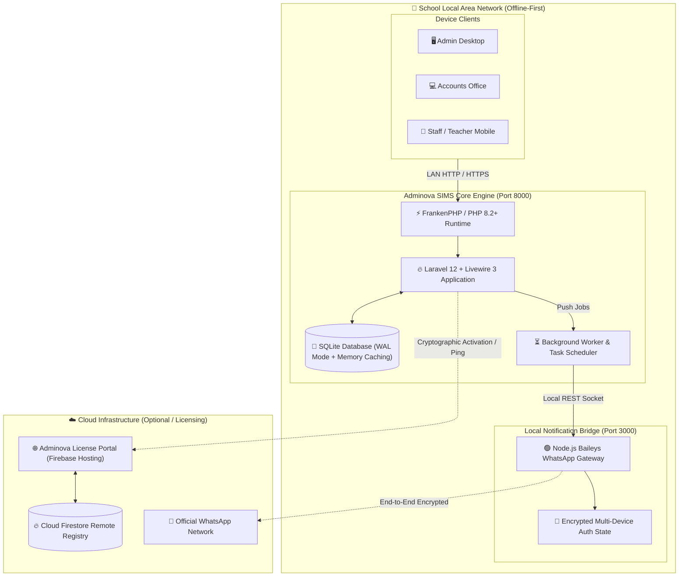
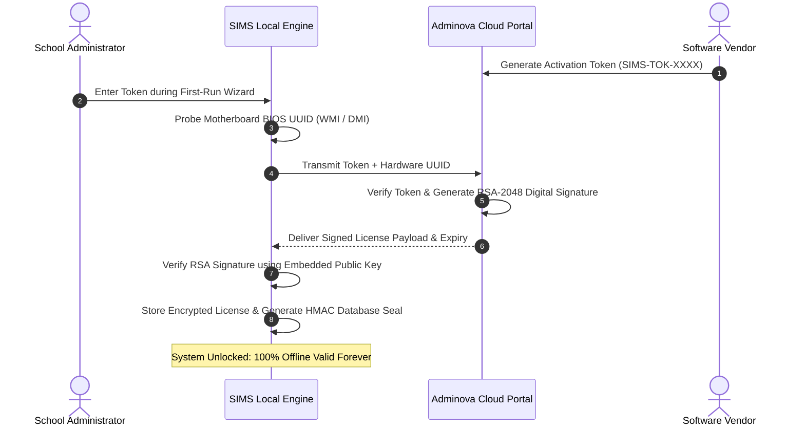

# Adminova SIMS (School Information Management System)

<div align="center">

[](https://github.com/saimimran87678-web/sims-app/releases/tag/v2.5.2)
[](https://laravel.com)
[](https://livewire.laravel.com)
[](https://php.net)
[](https://tailwindcss.com)
[](https://sqlite.org)
[](https://frankenphp.dev)
[](file:///d:/SIMS-Production/pricing.html)

**High-Performance, 100% Offline-First Campus Management & Institutional ERP Platform**

*Engineered for primary, secondary, and higher-secondary institutions, degree colleges, and multi-shift campuses.*

[Features](#-key-features--subsystems) • [Architecture](#-system-architecture) • [Quick Start](#-quick-start--installation) • [Repository Structure](#-repository-structure) • [Licensing & Security](#-hardware-locked-licensing-engine) • [Pricing Models](#-commercial-editions--pricing)

</div>

---

## 📖 Overview

**Adminova SIMS** is a production-grade, enterprise School Information Management System designed to eliminate internet dependency while providing modern, reactive web speeds (<400ms page transitions). 

Traditional cloud school portals suffer from high monthly latency, recurring per-SMS carrier bills, and total operational collapse during network downtime. Adminova SIMS solves this with an **offline-first local-LAN deployment**, native **SQLite Write-Ahead Logging (WAL)** engine, an automated zero-cost **WhatsApp notification gateway**, and a mathematical **Master Timetable & Daily Teacher Substitution Balancer**.

```
  ┌────────────────────────────────────────────────────────────────────────┐
  │                           ADMINOVA SIMS                                │
  │                                                                        │
  │   ⚡ <400ms Sub-Second Speed   │   📶 100% Offline-First Local LAN     │
  │   💳 3-Part Bank Challans     │   📲 Automated WhatsApp (Zero SMS Cost)│
  │   🗓️ Timetable & Substitutions│   🔐 Motherboard UUID RSA-2048 License │
  └────────────────────────────────────────────────────────────────────────┘
```

---

## 🏛️ System Architecture

Adminova SIMS operates as a self-contained local server running on campus hardware, accessible across the local network (LAN / Wi-Fi) by admins, accountants, and teachers, with optional cloud-synced license management.



---

## 🚀 Key Features & Subsystems

### 🎓 1. Student Lifecycle & Multi-Shift Dual Context
- **Bi-Context Shifter:** Seamlessly switch between **Academic Sessions** (e.g., *2025-2026*, *2026-2027*) and **Campus Shifts** (*Morning*, *Evening*, *Regular*) from the header without page reloads.
- **Complete Student Profiles:** Registration numbers, roll numbers, blood groups, medical records, guardian emergency contacts, and previous school history.
- **Automated Academic Progression:** Bulk class promotion/demotion engine with historical snapshot retention and session-specific enrollments.

### 💳 2. Financial Accounting & 3-Part Bank Challans
- **Standard 3-Part Bank Challan Generation:** Generates professional A4 printouts featuring **Bank Copy**, **School Copy**, and **Student Copy** with unique barcode/tracking tokens.
- **Dynamic Fee Structures:** Custom fee heads (Tuition, Computer Lab, Exam Fee, Sports, Admission, Utility charges) configurable per class or section.
- **Split & Partial Payments:** Real-time balance recalculation, concession overrides, surcharge/fine application, and one-click receipt issuance.
- **Defaulter Tracking:** Automated overdue aging reports, non-payment alerts, and WhatsApp invoice dispatch.

### 📲 3. Automated Digital WhatsApp Gateway (Zero Per-SMS Cost)
- **Local Microservice Bridge:** Powered by an embedded Node.js Baileys socket gateway. Pairs in seconds via standard QR code scan using school's Android/iPhone phone.
- **Zero Ongoing Messaging Costs:** Completely bypasses costly third-party SMS aggregators (Twilio, infobip, local telco SMS bundles).
- **Automated Triggers:**
  - 🧾 **Instant Fee Receipts:** Sends interactive payment confirmation with PDF vouchers immediately upon fee collection.
  - 🚨 **Morning Absence Alerts:** Automatically dispatched to guardian phones when student attendance is marked absent.
  - 📢 **School Announcements & Datesheets:** Batch broadcasts for exams, emergencies, and fee deadlines.

### 🗓️ 4. Master Timetable & Intelligent Substitution Balancer
- **Constraint-Based Schedule Grid:** Full visual matrix for classes, periods, break intervals, rooms, and assigned educators.
- **Zero-Conflict Guarantee:** Hard constraint checks prevent educator double-booking or room collisions in real-time.
- **1-Click Morning Teacher Substitution:** When an educator is marked absent or on leave, the substitution engine evaluates educator workloads, subject compatibility, and period availability to balance substitute assignments in under 5 seconds.
- **Printable Master Sheets:** Export class-wise, teacher-wise, and master daily timetable PDFs.

### 📝 5. Examination, Datesheet & Automated Grading
- **Exam Management:** Term exams, midterms, unit tests, and annual finals.
- **Interactive Datesheet Builder:** Conflict-free schedule generator with automated room and invigilator allocation.
- **Automated Marks Ledger & Report Cards:** Class-wise mark entry grids, automatic percentage/GPA/grade calculations, position rankings, and batch PDF report card generation.

### 🔐 6. Hardware-Locked RSA-2048 Cryptographic Licensing
- **Motherboard BIOS UUID Lock:** The application extracts the machine's immutable hardware identifier (`Win32_ComputerSystemProduct.UUID` / `/sys/class/dmi/id/product_uuid`) to prevent unauthorized cloning.
- **Asymmetric Signature Verification:** Offline validation using RSA-2048 public keys and SHA-256 signatures generated exclusively by the Adminova Licensing Cloud.
- **HMAC-SHA256 Anti-Tampering:** Local database integrity digests detect unauthorized manual edits to SQLite tables, immediately quarantining tampered installations.
- **Disposable Token Activation:** Quick 1-step activation using `SIMS-TOK-XXXX-XXXX` tokens.

---

## 📂 Repository Structure

```
d:\SIMS-Production/
├── sims-app/                          # Core Laravel 12 + Livewire 3 Application
│   ├── app/
│   │   ├── Http/Controllers/          # API & Web Controllers
│   │   ├── Livewire/                  # Reactive Components (Fees, Attendance, Exams)
│   │   ├── Models/                    # Eloquent Database Models
│   │   └── Services/                  # Licensing, WhatsApp, Timetable Engines
│   ├── database/                      # SQLite Schema, Migrations, and Seeders
│   ├── resources/views/               # Blade Templates, Tailwind UI & DaisyUI Themes
│   ├── routes/                        # Web, API, and Console Route Definitions
│   └── public/                        # Compiled Static Assets, Icons, and Document Templates
│
├── adminova-license-portal/           # Cloud Licensing Management Portal (React 19 + Vite)
│   ├── src/
│   │   ├── services/                  # RSA Key Generation, Token Registry & Firestore Sync
│   │   └── components/                # Institute & License Management UI
│   ├── firebase.json                  # Firebase Hosting Deployment Configuration
│   └── firestore.rules                # Security Rules for Remote License Registry
│
├── scripts/                           # Native Service & Automation Runners
│   ├── windows/                       # Windows Control Center & Batch Launchers
│   │   ├── services/                  # Background worker, scheduler, web daemons
│   │   ├── ControlCenter.cs           # Native C# WinForms Control Panel
│   │   ├── install.bat                # 1-Click Windows Setup & Path Registration
│   │   └── sims.bat                   # Global CLI Command Runner
│   ├── linux/                         # Ubuntu/Debian Production Systemd Services
│   │   ├── services/                  # sims-web.service, sims-queue.service, timers
│   │   └── install.sh                 # 1-Command Automated Linux Installer
│   └── build/                         # Inno Setup Windows Installer & Patch Builders
│
├── pricing.html                       # Interactive Customer Pricing & Feature Calculator
├── pricing-export.html                # High-Density Rate Card Export (PDF/Excel Ready)
├── manifest.json                      # Release v2.5.2 Distribution Manifest & Checksums
└── control-center.bat                 # Desktop GUI Launcher
```

---

## ⚡ Quick Start & Installation

### Option 1: Windows 1-Click Production Setup
For standard desktop servers running Windows 10/11 or Windows Server:

1. Clone or extract the repository into your preferred folder:
   ```cmd
   git clone https://github.com/saimimran87678-web/sims-app.git C:\SIMS
   cd C:\SIMS
   ```
2. Run the automated installer as Administrator:
   ```cmd
   install.bat
   ```
   *This automatically registers PATH variables, generates application keys, optimizes SQLite WAL settings, and compiles the native desktop Control Center.*
3. Launch the Control Center:
   ```cmd
   control-center.bat
   ```
   Or access the application directly via browser at `http://127.0.0.1:8000`.

---

### Option 2: Linux (Ubuntu / Debian) Production Setup
For institutional headless Linux servers running Nginx / Systemd:

1. Run the unified setup script:
   ```bash
   chmod +x scripts/linux/install.sh
   sudo ./scripts/linux/install.sh
   ```
2. Enable and start production background services:
   ```bash
   sudo systemctl enable --now sims-web
   sudo systemctl enable --now sims-queue
   sudo systemctl enable --now sims-scheduler.timer
   ```

---

### Option 3: Local Developer Environment

For developers contributing or modifying features:

```bash
# 1. Navigate to the core application
cd sims-app

# 2. Install PHP and Node dependencies
composer install
npm install

# 3. Configure environment
cp .env.example .env
php artisan key:generate

# 4. Migrate database and seed baseline defaults
touch database/database.sqlite
php artisan migrate --seed

# 5. Compile front-end assets
npm run build

# 6. Start local development server
php artisan serve
```

---

## 🛠️ Global CLI Management (`sims` Tool)

Adminova SIMS includes a comprehensive command-line management tool:

```bash
# Check complete system status & background workers
sims status

# Start all server daemons (Web, Queue Worker, Scheduler)
sims start

# Stop all background services cleanly
sims stop

# View live real-time application logs
sims logs

# Activate an offline installation using a remote token
sims activate --token=SIMS-TOK-XXXX-XXXX

# Clear and rebuild caches for high-speed operation
sims optimize
```

---

## 🔐 Hardware-Locked Licensing Engine

The licensing subsystem guarantees high security for commercial deployments without mandating constant internet connectivity:



---

## 💼 Commercial Editions & Pricing

Adminova SIMS offers flexible licensing tiers tailored for private schools, public model colleges, and government institutes:

| Plan Type | Small Campus (<400 Students) | Mid Campus (400 - 1,000 Students) | Large Campus (1,000+ Students) | Key Features Included |
| :--- | :---: | :---: | :---: | :--- |
| **All-in-One ERP + WhatsApp** | Rs 45,000 | Rs 70,000 | Rs 100,000 | Full ERP, 3-Part Vouchers, WhatsApp Gateway, Timetable & Exams |
| **Academic ERP Only** | Rs 30,000 | Rs 50,000 | Rs 75,000 | Admissions, Fee Vouchers, Attendance, Exams, Report Cards |
| **Timetable & Substitutions Only** | Rs 15,000 | Rs 25,000 | Rs 40,000 | Visual Grid, Teacher Workloads, 1-Click Daily Substitutions |

> 📊 **Explore Interactive Pricing Tools:**
> - [Interactive Pricing & ROI Calculator](pricing.html): Real-time comparison, SMS savings calculator, and quotation generator.
> - [Executive Rate Card Export](pricing-export.html): Clean, print-ready A4 rate sheet with instant PDF / CSV export.

---

## 🧪 Testing & Quality Assurance

SIMS maintains a comprehensive test suite across its financial, substitution, and licensing engines:

```bash
cd sims-app
php artisan test
```

- **Feature Tests:** Student promotion workflows, multi-shift filtering, and fee billing ledgers.
- **Security Tests:** RSA signature tampering prevention, hardware UUID mismatch enforcement, and expired license lockouts.
- **Timetable Tests:** Conflict detection logic and substitution workload balancing algorithms.

---

## 👥 Authors & Maintainers

- **Lead Architect & Developer:** Adminova Solutions Team
- **Repository:** [`saimimran87678-web/sims-app`](https://github.com/saimimran87678-web/sims-app)
- **Support & Commercial Inquiries:** Contact your assigned vendor or portal administrator.

---

## 📄 License

Adminova SIMS is proprietary commercial software. Unauthorized copying, decompilation, redistribution, or modification of the cryptographic licensing subsystem is strictly prohibited. Refer to [LICENSE](sims-app/LICENSE) for terms.
