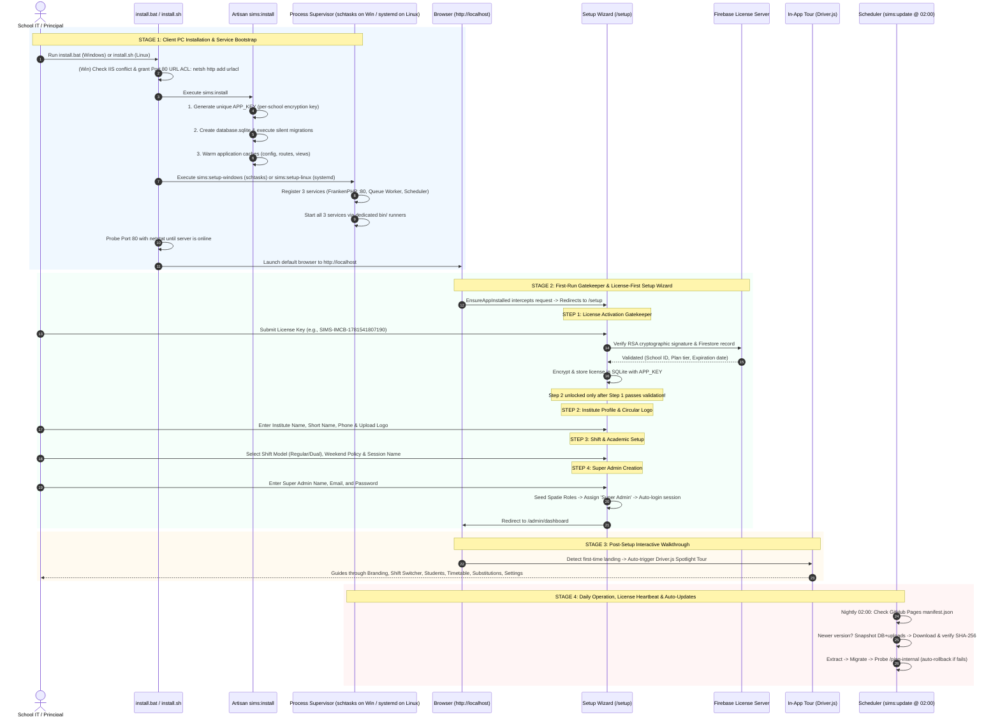

# SIMS Implementation Plan: Standalone Deployment, Licensing, Setup Wizard & In-App Tour

---

## 1. Core Server Simplification: Replacing Nginx, PM2, and Redis

To make SIMS completely portable, lightweight, and identical across both Windows and Linux, all heavy server daemons are completely eliminated:

| Legacy Component | New Replacement on Windows | New Replacement on Linux | Why This is Better |
|---|---|---|---|
| **Nginx + PHP-FPM** | **FrankenPHP** (`runtime/frankenphp.exe`) | **FrankenPHP** (`runtime/frankenphp`) | Single binary, zero config files, serves directly on `:80`. Works identically on Windows & Linux. |
| **PM2 Process Manager** | **Windows Task Scheduler** (`schtasks`) | **Linux `systemd`** (`systemctl`) | **Zero extra software needed.** Both tools are pre-installed into the operating system. They auto-boot on startup and restart crashed processes. |
| **Redis Server (`redis-server`)** | **Database (SQLite)** (`CACHE_STORE=database`, `QUEUE_CONNECTION=database`) | **Database (SQLite)** (`CACHE_STORE=database`, `QUEUE_CONNECTION=database`) | Eliminates Redis installation, RAM overhead, port conflicts (6379), and PHP Redis extension requirements. |
| **Node.js Runtime** | **Removed completely** | **Removed completely** | Assets are pre-built on developer PC (`npm run build`). No Node.js process runs on the client PC. |

### Windows vs. Linux Equivalent Tooling

| Requirement | Windows Tool | Linux Tool |
|---|---|---|
| **Auto-boot on system startup** | `schtasks /create ... /sc ONSTART` | `systemctl enable sims-web sims-queue sims-scheduler` |
| **Run in background (headless)** | `schtasks /run ... /ru SYSTEM` (fallback to current user) | `systemd` background service unit |
| **Auto-restart if crashed** | Task Scheduler Restart Trigger | `Restart=always` & `RestartSec=5` in systemd unit |
| **Manual start/stop/restart** | `schtasks /run` or `bin\run-web.bat` | `systemctl start/stop/restart sims-*` |
| **Check service status** | `schtasks /query /tn SIMS-*` | `systemctl status sims-web` |
| **External software to install?** | **None (built into Windows)** | **None (built into Linux)** |

---

## 2. Codebase Implementation Audit

| Component / File | Implementation State in Codebase | Target Requirement | Status |
|---|---|---|---|
| **Legacy Cleanup** | `.sh` scripts, `Guides/`, and `whatsapp-service/` removed (`git commit 5f9e28e`) | Clean workspace without legacy files | ✅ **Done** |
| **Redis Decoupling** | Clean `.env.example` without Redis dependencies | SQLite database driver for cache, queue, session | ✅ **Done** |
| **SQLite Concurrency** | Configured in `config/database.php` | `busy_timeout => 5000`, `journal_mode => 'WAL'`, `synchronous => 'NORMAL'` | ✅ **Done** |
| **App Versioning** | Set in `config/app.php` and `.env` | `'version' => env('APP_VERSION', '2.5.0')` | ✅ **Done** |
| **Health Check Route** | Implemented in `routes/web.php` | `Route::get('/ping-internal')` (localhost-only, no auth) | ✅ **Done** |
| **Installer Command** | Implemented via `SimsInstall.php` | `php artisan sims:install` (key generation, migrations, cache) | ✅ **Done** |
| **Process Supervisors** | Implemented via `SetupWindows.php` & `SetupLinux.php` | Native `schtasks` (Windows) & `systemd` (Linux) service setups | ✅ **Done** |
| **1-Click Installers** | Created `install.bat` and `install.sh` with IIS & Port 80 polling | Root installer scripts for client machines | ✅ **Done** |
| **First-Run Gatekeeper** | Implemented via `EnsureAppInstalled.php` | Intercepts unconfigured app and redirects to `/setup` | ✅ **Done** |
| **Setup Wizard** | Implemented via `SetupWizard.php` | 4-step wizard: License ➔ Branding ➔ Shifts ➔ Super Admin | ✅ **Done** |
| **In-App Tour** | Driver.js tour in `tour.js` & `admin.blade.php` | 6-step spotlight walkthrough focusing on Timetable & Substitutions | ✅ **Done** |
| **Auto-Update Engine** | `SimsUpdate.php` & nightly 02:00 schedule | Nightly update command with SHA-256 and atomic rollback | ✅ **Done** |
| **Release Builder** | `build-release.sh` & `download-windows-runtime.sh` | Developer packaging pipeline with secret sanitization and portable PHP/FrankenPHP | ✅ **Done** |

---

## 3. Architecture Flow Overview



---

## 4. Implementation Details by Phase

---

### Phase 1: Foundation Layer, Concurrency Engine & Redis Removal ✅ [COMPLETED]
*Decouples Redis, sets up database-backed queues/cache, and configures SQLite WAL concurrency.*

#### [MODIFY] [database.php](file:///home/saim/SIMS/sims-app/config/database.php)
- Configured SQLite for multi-teacher concurrency:
  - `'busy_timeout' => 5000` (waits 5s if locked; prevents `database is locked` exceptions)
  - `'journal_mode' => 'WAL'` (Write-Ahead Logging: readers do not block writers)
  - `'synchronous' => 'NORMAL'` (fast and crash-safe)

#### [MODIFY] [.env.example](file:///home/saim/SIMS/sims-app/.env.example) & [.env](file:///home/saim/SIMS/sims-app/.env)
- Configured SQLite database tables for cache, queue, and sessions (Zero Redis required):
  ```dotenv
  CACHE_STORE=database
  QUEUE_CONNECTION=database
  SESSION_DRIVER=database
  ```
- Removed Redis host/port/client requirements.

#### [MODIFY] [app.php](file:///home/saim/SIMS/sims-app/config/app.php)
- Added `'version' => env('APP_VERSION', '2.5.0')`.
- Added `'update_manifest_url' => env('UPDATE_MANIFEST_URL', ...)`.

#### [MODIFY] [web.php](file:///home/saim/SIMS/sims-app/routes/web.php)
- Added `/ping-internal` endpoint:
  - Allowed only from localhost (`127.0.0.1`, `::1`).
  - Completely bypasses session and auth middleware.
  - Returns JSON `{"status": "alive", "version": "...", "database": "ok"}`.

---

### Phase 2: Client Installation Engine & Service Supervisor ✅ [COMPLETED]
*Sets up FrankenPHP and native OS supervisors (Windows Task Scheduler & Linux systemd).*

#### [NEW] [SimsInstall.php](file:///home/saim/SIMS/sims-app/app/Console/Commands/SimsInstall.php)
- Command: `php artisan sims:install`
- Actions:
  1. Checks if `APP_KEY` is present. If missing, executes `Artisan::call('key:generate', ['--force' => true])`.
  2. Creates `database/database.sqlite` if missing and sets permissions.
  3. Executes silent migrations (`php artisan migrate --force`).
  4. Warms configuration and route caches (`config:cache`, `route:cache`, `view:cache`).

#### [NEW] [SetupWindows.php](file:///home/saim/SIMS/sims-app/app/Console/Commands/SetupWindows.php)
- Command: `php artisan sims:setup-windows`
- Generates dedicated batch runners in `bin/` (`run-web.bat`, `run-queue.bat`, `run-scheduler.bat`) that set the working directory to `sims-app`.
- Uses Windows `schtasks.exe` to register 3 auto-boot services:
  1. `SIMS-Web`: `bin\run-web.bat` (FrankenPHP on Port 80)
  2. `SIMS-Queue`: `bin\run-queue.bat` (`php artisan queue:work --sleep=3 --tries=3`)
  3. `SIMS-Scheduler`: `bin\run-scheduler.bat` (`php artisan schedule:work`)
- Configures tasks with `/SC ONSTART /RU SYSTEM /RL HIGHEST /F` (with fallback to current user if restricted).

#### [NEW] [SetupLinux.php](file:///home/saim/SIMS/sims-app/app/Console/Commands/SetupLinux.php)
- Command: `php artisan sims:setup-linux`
- Creates 3 native `systemd` service units:
  1. `/etc/systemd/system/sims-web.service` (`runtime/frankenphp php-server --listen :80 --root sims-app/public`)
  2. `/etc/systemd/system/sims-queue.service` (`php sims-app/artisan queue:work --sleep=3 --tries=3`)
  3. `/etc/systemd/system/sims-scheduler.service` (`php sims-app/artisan schedule:work`)
- Configures units with `Restart=always` and `RestartSec=5`.
- Runs `systemctl daemon-reload`, enables and starts all 3 services.

#### [NEW] [install.bat](file:///home/saim/SIMS/install.bat) (Windows 1-Click Installer)
- Runs as Administrator:
  1. Detects and stops IIS (`W3SVC`) if running to free Port 80.
  2. Grants Port 80 URL ACL: `netsh http add urlacl url=http://+:80/ user=Everyone`.
  3. Runs `sims:install` with bundled portable PHP (`runtime\php\php.exe`).
  4. Runs `sims:setup-windows`.
  5. Actively checks Port 80 via `netstat` and launches background server if needed.
  6. Opens default browser to `http://localhost`.

#### [NEW] [install.sh](file:///home/saim/SIMS/install.sh) (Linux 1-Click Installer)
- Runs `php sims-app/artisan sims:install` followed by `sudo php sims-app/artisan sims:setup-linux`.

---

### Phase 3: First-Run Gatekeeper & License-First Setup Wizard ✅ [COMPLETED]
*Provides a browser-based setup wizard when `http://localhost` is first opened.*

#### [NEW] [EnsureAppInstalled.php](file:///home/saim/SIMS/sims-app/app/Http/Middleware/EnsureAppInstalled.php)
- Global web middleware:
  - If `Setting::getGlobal('app_installed')` is false and route is not `/setup*`, redirects to `/setup`.
  - If `Setting::getGlobal('app_installed')` is true and user visits `/setup*`, redirects to `/admin/dashboard`.

#### [NEW] [SetupWizard.php](file:///home/saim/SIMS/sims-app/app/Livewire/Setup/SetupWizard.php)
- Multi-step Livewire 3 component:
  - **Step 1 (License Activation Gatekeeper)**:
    - Verifies license against Firebase and RSA signature (`LicenseVerifier`).
    - Computes HMAC integrity hash with newly generated `APP_KEY` and saves encrypted record to SQLite `software_licenses`.
    - Updates `LICENSE_KEY` in `.env`.
    - Step 2 is unlocked only after Step 1 passes.
  - **Step 2 (Institute Profile & Logo)**:
    - Institute Name, Formal Name, Short Name, Phone, Address.
    - Drag-and-drop Logo Upload with circular preview (stored in `storage/app/public/branding/`).
  - **Step 3 (Academic & Shift Setup)**:
    - Shift Model: Regular (Single Morning) vs. Dual (Morning + Evening).
    - Weekend Policy: Saturday & Sunday vs. Sunday only.
    - Session Name (e.g. `2026-2027`) -> creates active session row.
  - **Step 4 (Super Admin Creation)**:
    - Name, Email, Password.
    - Seeds Spatie roles (`RolesAndPermissionsSeeder`).
    - Creates user and assigns Spatie `'Super Admin'` role (full bypass via `Gate::before`).
    - Sets `app_installed = true` and `launch_first_tour = true`.
    - Logs user in (`Auth::login($user)`) and redirects to `/admin/dashboard`.

#### [NEW] [setup-wizard.blade.php](file:///home/saim/SIMS/sims-app/resources/views/livewire/setup/setup-wizard.blade.php)
- Clean, responsive Tailwind CSS UI with 4-step progress indicator and validation error feedback.

---

### Phase 4: In-App Guided Product Tour ✅ [COMPLETED]
*Provides an interactive spotlight walkthrough on first login and on demand.*

#### [NEW] [tour.js](file:///home/saim/SIMS/sims-app/resources/js/tour.js) & [public/js/tour.js](file:///home/saim/SIMS/sims-app/public/js/tour.js)
- Driver.js configuration:
  - Step 1: `#tour-institute-branding` (Institute Logo & Formal Name configured during setup).
  - Step 2: `#tour-session-selector` (Academic Year & Shift Switcher).
  - Step 3: `#tour-students` (Student & Class Management).
  - Step 4: `#tour-timetable` (Timetable & Bell Schedules - *per user request*).
  - Step 5: `#tour-substitutions` (Teacher Substitutions Engine - *per user request*).
  - Step 6: `#tour-settings` (System Settings & Offline License Management).
  - Saves `localStorage.setItem('sims_tour_completed', 'true')` and calls `POST /admin/tour/complete` to sync `Setting::setGlobal('launch_first_tour', false)`.

#### [NEW] [driver.js](file:///home/saim/SIMS/sims-app/public/vendor/driverjs/)
- Standalone offline bundle: `driver.js.iife.js`, `driver.css`, and custom Tailwind UI theme `driver-theme.css`.

#### [MODIFY] [admin.blade.php](file:///home/saim/SIMS/sims-app/resources/views/components/layouts/admin.blade.php)
- Auto-triggers `window.startSIMSTour()` if `launch_first_tour` setting is true.
- Adds "Take Product Tour" button in the Super Admin profile dropdown.
- Adds target IDs (`#tour-institute-branding`, `#tour-session-selector`, `#tour-students`, `#tour-timetable`, `#tour-substitutions`, `#tour-settings`).

---

### Phase 5: Continuous Maintenance, Auto-Updates & Safe Rollback ✅ [COMPLETED]
*Nightly automated updates with SHA-256 checksum verification and atomic rollback.*

#### [NEW] [SimsUpdate.php](file:///home/saim/SIMS/sims-app/app/Console/Commands/SimsUpdate.php)
- Command: `php artisan sims:update {--check} {--force} {--manifest=} {--verify-checksum} {--skip-health-check}`
- Flow:
  1. Checks remote GitHub Pages / CDN `manifest.json`.
  2. If newer: snapshots SQLite DB and uploads (`storage/app/public/`) -> `storage/snapshots/{timestamp}/`.
  3. Downloads release ZIP and strictly verifies **SHA-256 Checksum** against manifest `checksum`/`sha256`. Rejects corrupt or tampered packages before extracting.
  4. Scans zip entries for path traversal security and extracts update files.
  5. Runs silent database migrations (`php artisan migrate --force`).
  6. Probes `http://127.0.0.1:80/ping-internal` health check endpoint.
  7. If ping fails: auto-reverts database and files from snapshot.
  8. If ping succeeds: updates `APP_VERSION` in `.env`, records verified SHA-256 checksum in SQLite `settings` table, re-warms cache, and logs success.

#### [MODIFY] [console.php](file:///home/saim/SIMS/sims-app/routes/console.php)
- Registered nightly update schedule:
  ```php
  Schedule::command('sims:update')->dailyAt('02:00')->withoutOverlapping();
  ```

---

### Phase 6: Developer Packaging & Distribution Pipeline ✅ [COMPLETED]
*Builds release package on the developer machine with strict secret sanitization and portable runtime.*

#### [NEW] [download-windows-runtime.sh](file:///home/saim/SIMS/download-windows-runtime.sh)
- Downloads and pre-configures portable Windows binaries into `runtime/`:
  - `runtime/frankenphp.exe` (Web server on port 80)
  - `runtime/php/php.exe` (PHP 8.2 CLI NTS x64) + extensions
  - `runtime/php/php.ini` (Configured for SQLite WAL, cURL, MBString, Zip)

#### [NEW] [build-release.sh](file:///home/saim/SIMS/build-release.sh)
- Runs strictly on the Developer machine:
  1. Runs `composer install --no-dev --optimize-autoloader`.
  2. Pre-flight verification that `public.pem` is present.
  3. **Strict Secret Exclusion**: `private.pem` is strictly prohibited from entering the distribution staging directory or ZIP archive.
  4. **Sanitized `.env`**: Emits production `.env` where `APP_KEY=` and `LICENSE_KEY=` are strictly empty (so client installer generates fresh app key and setup wizard collects license).
  5. Bundles `runtime/` (if present) and `bin/` runners into the package for 100% zero-install experience.
  6. Packages complete distribution into `dist/releases/SIMS-vX.Y.Z.zip` along with `install.bat`, `install.sh`, and `README.txt`.
  7. Computes SHA-256 hash and emits `dist/releases/manifest.json` for GitHub Pages / CDN auto-update serving.

---

## 5. Verification Plan

| Test Case | Verification Method | Expected Outcome |
|---|---|---|
| **1. Zero Redis Requirement** | Check `.env` and `config/queue.php` / `config/cache.php` | App runs queue jobs and cache without `redis-server` installed |
| **2. SQLite WAL Mode** | `php artisan tinker --execute="echo DB::select('PRAGMA journal_mode')[0]->journal_mode;"` | Returns `wal` |
| **3. Internal Health Ping** | `curl -s http://127.0.0.1/ping-internal` | Returns `{"status":"alive",...}` without auth session |
| **4. APP_KEY Generation** | Clear `APP_KEY` from `.env`, run `php artisan sims:install` | Generates new 32-byte base64 key, migrates DB |
| **5. Setup Gatekeeper** | Visit `http://localhost/admin/dashboard` when unconfigured | 302 Redirect to `/setup` |
| **6. License Gatekeeper** | Enter invalid key in Step 1 of `/setup` | Helpful error shown; Steps 2-4 remain locked |
| **7. Super Admin Role** | Complete `/setup`, inspect user roles | User has `'Super Admin'` role with full bypass |
| **8. Guided Tour Trigger** | Complete setup and land on `/admin/dashboard` | Driver.js spotlight starts automatically |
| **9. Rollback Engine** | Simulate failed update in `sims:update` | Pre-update DB and uploads are restored intact |
| **10. Service Supervisor** | Check `schtasks` (Win) or `systemctl` (Linux) | 3 background services running with auto-start enabled |
