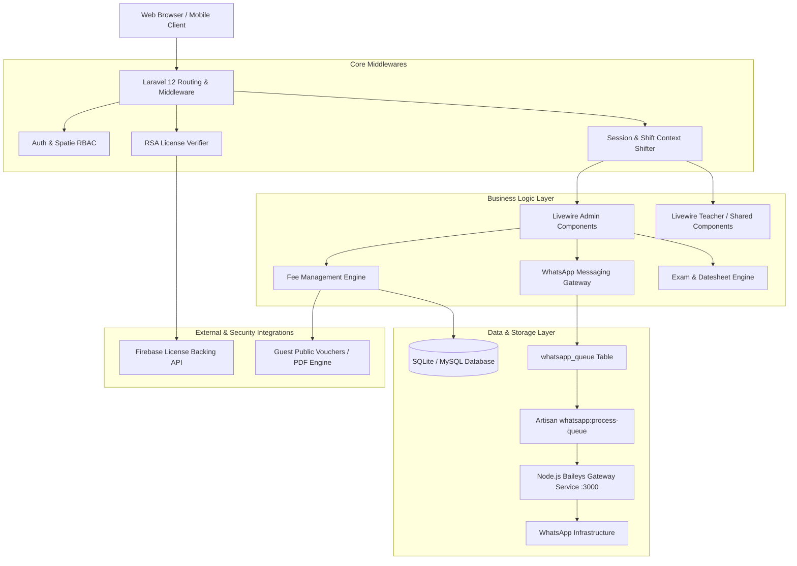
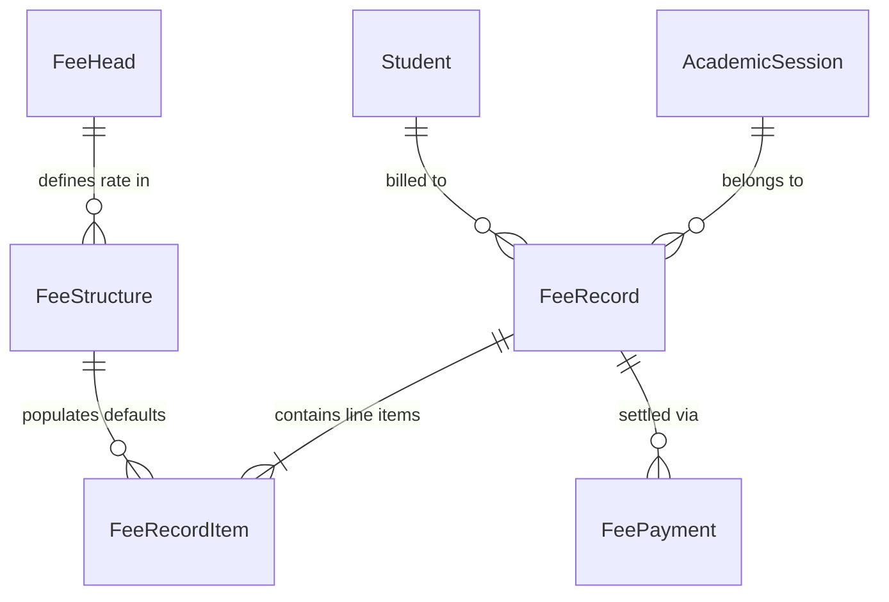
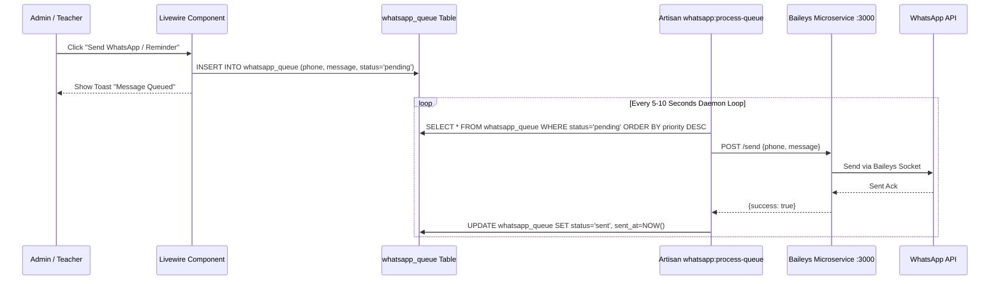
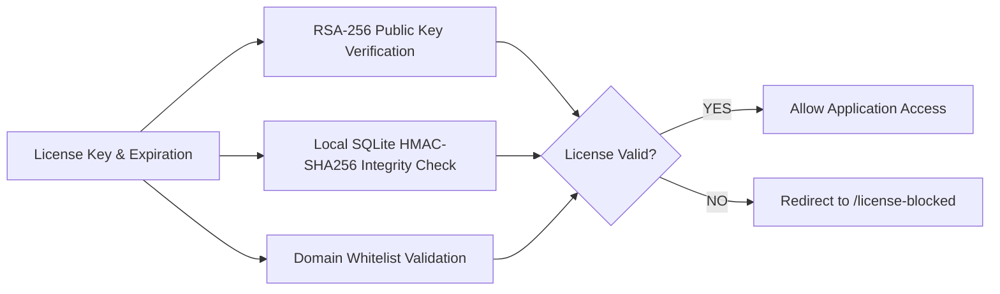

# School Information Management System (SIMS) - Technical Documentation

> **Version:** 2.5.0 Production  
> **Framework:** Laravel 12.x | Livewire 3.7+ | PHP 8.3+  
> **Database:** SQLite / MySQL / PostgreSQL  
> **Frontend:** Tailwind CSS 3.x, Alpine.js 3.4+, DaisyUI  

---

## Table of Contents

1. [Executive Overview & System Architecture](#1-executive-overview--system-architecture)
2. [Technology Stack & Core Dependencies](#2-technology-stack--core-dependencies)
3. [Core Subsystems & Technical Deep Dive](#3-core-subsystems--technical-deep-dive)
   - [Subsystem A: Dual-Context Academic Session & Shift Shifter](#subsystem-a-dual-context-academic-session--shift-shifter)
   - [Subsystem B: Financial & Fee Management Engine](#subsystem-b-financial--fee-management-engine)
   - [Subsystem C: WhatsApp Queue & Gateway Integration](#subsystem-c-whatsapp-queue--gateway-integration)
   - [Subsystem D: Examination, Datesheet & Marks Engine](#subsystem-d-examination-datesheet--marks-engine)
   - [Subsystem E: Timetabling, Period Config & Substitutions](#subsystem-e-timetabling-period-config--substitutions)
   - [Subsystem F: Granular RBAC & Feature Sharing Architecture](#subsystem-f-granular-rbac--feature-sharing-architecture)
   - [Subsystem G: Remote Licensing & RSA Cryptographic Security](#subsystem-g-remote-licensing--rsa-cryptographic-security)
4. [Database Architecture & Entity Relationships](#4-database-architecture--entity-relationships)
5. [Route Matrix & Access Endpoints](#5-route-matrix--access-endpoints)
6. [Console Commands & Background Daemons](#6-console-commands--background-daemons)
7. [Deployment & Production Operations Guide](#7-deployment--production-operations-guide)
8. [Testing & Quality Assurance](#8-testing--quality-assurance)

---

## 1. Executive Overview & System Architecture

The **School Information Management System (SIMS)** is an enterprise-grade academic administration platform built on Laravel 12 and Livewire 3. SIMS consolidates all core institutional operations—student admissions, multi-shift academic tracking, tuition fee billing, automated WhatsApp notifications, examination scheduling, substitute teacher management, and granular role-based delegation—into a fast, real-time single-page application experience.

### System Architecture Diagram



---

## 2. Technology Stack & Core Dependencies

### Backend Stack
* **Language & Runtime:** PHP 8.3+
* **Application Framework:** Laravel 12.43.1
* **Reactive Components:** Livewire 3.7+
* **Role & Permission Management:** Spatie Laravel-Permission 6.24+
* **Document Generation:** Barryvdh Laravel DomPDF 3.1+
* **Database Engine:** SQLite (configured with WAL mode and indices) / MySQL / PostgreSQL

### Frontend Stack
* **Build Tooling:** Vite 5.4+ with `laravel-vite-plugin`
* **CSS Framework:** Tailwind CSS 3.1+ with `@tailwindcss/forms`
* **UI Components & Theme:** DaisyUI / Glassmorphism Design System
* **Client Interactivity:** Alpine.js 3.4+
* **Datepickers & Tooltips:** Flatpickr 4.6+

### Process & Daemon Management
* **Task Runner & Process Orchestrator:** Concurrently 9.0+
* **External WhatsApp Microservice:** Node.js + `@whiskeysockets/baileys` HTTP Bridge (Port 3000)

---

## 3. Core Subsystems & Technical Deep Dive

### Subsystem A: Dual-Context Academic Session & Shift Shifter

#### Architecture Overview
SIMS features multi-tenancy model operating across two dimensions: **Academic Session** (e.g., *2025-2026*) and **Shift Type** (*Morning*, *Evening*, *Regular*).

```
Academic Session (ID: 1, Name: 2025-2026)
├── Morning Shift Context (Class 1-A, Morning Timetable, Morning Fee Structures)
└── Evening Shift Context (Class 1-A, Evening Timetable, Evening Fee Structures)
```

#### Key Implementation Details
1. **Session & Shift Switching (`SessionShifter.php`)**:
   - Persists `selected_academic_session_id` and `selected_shift_type` in the HTTP session.
   - Exposes global helper `AcademicSession::getActiveSessionId()` which respects manual admin session overrides, falling back to the active database session.
2. **Shift Scoping**:
   - `Enrollment` model connects `Student` to `Class` for a specific `AcademicSession` and `shift_type`.
   - `Class`, `FeeStructure`, `Timetable`, `PeriodConfig`, and `Holiday` models are automatically scoped to the active shift context.

---

### Subsystem B: Financial & Fee Management Engine

#### Domain Model & Data Lifecycle
The Fee Engine handles invoice generation, partial payment ledgers, defaulter reporting, and guest voucher rendering.



#### Core Components
1. **Invoice Generator (`InvoiceGenerator.php`)**:
   - Generates batch or individual fee vouchers for a selected Class, Academic Session, and Shift.
   - Prevents duplicate invoicing for the same month/session via unique constraint verification on `fee_records`.
2. **Payment Collection & Ledger (`RecordPayment.php` & `StudentLedger.php`)**:
   - Supports partial, full, and excess payments.
   - Calculates real-time balance remaining: `total_due = fee_record_items.amount - fee_payments.amount_paid`.
3. **Public Guest Vouchers (`PublicVoucherController.php`)**:
   - Each `FeeRecord` generates a secure cryptographic 64-character token (`access_token`).
   - Parents/Students access mobile-optimized digital vouchers and print PDF copies via public routes `/v/{token}` without requiring portal login.
4. **Defaulter List & Export Engine (`DefaulterList.php`)**:
   - Aggregate query calculates total outstanding balance per student across all unpaid/partial bills.
   - **Excel Export**: Uses native HTML tab-separated spreadsheet formatting for instant opening in Microsoft Excel.
   - **CSV Export**: Direct stream response with proper RFC 4180 escaping.
   - **Print Layout**: Dedicated `@media print` CSS template with institutional letterhead.

---

### Subsystem C: WhatsApp Queue & Gateway Integration

#### Architectural Design
WhatsApp integration uses a non-blocking queue design. Livewire actions push messages into `whatsapp_queue`, which a background daemon processes via HTTP calls to an isolated Node.js Baileys service.



#### Component Matrix
* **Unified Dashboard (`WhatsAppSetup.php` & `whatsapp-setup.blade.php`)**:
  - Unified tabbed UI featuring **WhatsApp Setup** (QR Pairing & Health), **Queue Manager** (Real-time monitoring with Student name/class metadata, force dispatch, clear queue), and **Message Templates**.
* **Template Engine (`PhoneHelper.php`)**:
  - Parses dynamic placeholders in message templates:
    - `{student_name}`, `{father_name}`, `{roll_no}`, `{admission_no}`, `{class_name}`, `{amount}`, `{due_date}`, `{challan_link}`.
* **Background Worker (`ProcessWhatsAppQueue.php`)**:
  - Artisan command `php artisan whatsapp:process-queue` executes continuously in non-blocking mode with adjustable batch size, delay interval, and retry count.

---

### Subsystem D: Examination, Datesheet & Marks Engine

#### Features
1. **Exam Configuration (`ExamManager.php`)**:
   - Defines exams (e.g., *Midterm 2025*, *Final Term 2026*) assigned to specific sessions and classes.
2. **Marks & Grade Rules (`MarksConfig.php` & `GradeManager.php`)**:
   - Custom max marks, passing thresholds, weightage, and letter grade conversion rules.
   - Includes support for marking students absent or exempt.
3. **Datesheet Generator (`DatesheetManager.php` & `DatesheetController.php`)**:
   - Configures exam schedules per class, date, time slot, and subject.
   - Generates printable datesheets formatted for institutional distribution.

---

### Subsystem E: Timetables, Period Config & Substitutions

#### Subsystem Architecture
* **Period Config Manager (`PeriodConfigManager.php`)**:
  - Configures daily class timings, period durations, assembly slots, and break periods per shift.
* **Master Timetable (`ScheduleManager.php`)**:
  - Assigns teachers, subjects, classes, and rooms to periods for Monday through Saturday.
* **Daily Substitution Manager (`SubstitutionManager.php`)**:
  - Identifies absent teachers for any selected date.
  - Automatically recommends available substitute teachers who have free periods during the absent teacher's assigned slots.
  - Generates daily printable substitution sheets for staff notification.

---

### Subsystem F: Granular RBAC & Feature Sharing Architecture

#### Dual-Layer Authorization
SIMS combines Spatie's role-based permission system (`spatie/laravel-permission`) with a custom **Feature Sharing Engine** (`FeatureSharingManager.php`).

```
Default Admin Role  ---> Full Access to All Admin Modules
Default Teacher Role ---> Access to Attendance, My Schedule, My Class Grades
                            │
                            ▼ (Delegated via Feature Sharing)
                      Granted Access to Admin Exams / Fee / Students
                      (Executes Admin Livewire components rendered within Teacher Layout)
```

#### Shared Execution Flow
Teachers granted shared admin permissions (e.g., `fees.manage`) can access admin views via `/teacher/shared/fee/*`. The application loads the admin Livewire logic (`InvoiceGenerator.php`) while rendering it wrapped in the teacher's navigation chrome.

---

### Subsystem G: Remote Licensing & RSA Cryptographic Security

#### Anti-Tampering & Security Layers



#### Verification Pipeline (`LicenseVerifier.php` & `LicenseStatus.php`)
1. **RSA-SHA256 Signature**:
   - Remote Firebase license server issues signed payload: `licenseKey|YYYY-MM-DD HH:mm:ss|status`.
   - Verified locally using public key PEM (`LicenseVerifier::verifyRsaSignature`).
2. **Local Database Integrity (HMAC-SHA256)**:
   - Prevents manual modification of SQLite `software_licenses` table rows (`computeIntegrityHash`).
3. **Domain Whitelist Enforcement**:
   - Restricts application execution to authorized domain names or IP addresses (exempting local dev environments `localhost`, `127.0.0.1`).

---

## 4. Database Architecture & Entity Relationships

### Core Database Tables

| Table Name | Primary Purpose | Foreign Keys / Associations |
| :--- | :--- | :--- |
| `users` | System accounts (Admins, Teachers, Staff) | `class_id` |
| `students` | Student demographic & contact registry | Belongs to `Enrollment` |
| `academic_sessions` | Institutional academic years | Has many `Enrollment`, `Class` |
| `classes` | Classes / Grades (e.g., Class 9th, 10th) | `academic_session_id`, `next_class_id` |
| `enrollments` | Student class assignment per session/shift | `student_id`, `class_id`, `academic_session_id` |
| `fee_heads` | Particular fee categories (Tuition, Admission) | Has many `FeeStructure` |
| `fee_structures` | Fee rates per class, session, and shift | `fee_head_id`, `class_id`, `academic_session_id` |
| `fee_records` | Issued monthly student vouchers | `student_id`, `academic_session_id` |
| `fee_record_items` | Itemized charges on a fee voucher | `fee_record_id`, `fee_head_id` |
| `fee_payments` | Financial payment transactions | `fee_record_id` |
| `whatsapp_queue` | Message dispatch queue | `student_id` |
| `exams` | Academic examinations | `academic_session_id` |
| `exam_schedules` | Exam subject datesheet slots | `exam_id`, `class_id`, `subject_id` |
| `timetables` | Weekly period schedule grid | `class_id`, `subject_id`, `teacher_id` |
| `period_configs` | Daily bell schedules per shift | `academic_session_id` |
| `teacher_attendances`| Daily teacher attendance registry | `teacher_id`, `academic_session_id` |
| `software_licenses` | RSA Cryptographic license cache | Stored integrity hash |

---

## 5. Route Matrix & Access Endpoints

### Public Routes (Unauthenticated / Guest)

| HTTP Method | Route URL | Controller / Action | Description |
| :--- | :--- | :--- | :--- |
| `GET` | `/v/{token}` | `PublicVoucherController@show` | Digital Student Fee Voucher view |
| `GET` | `/v/{token}/pdf` | `PublicVoucherController@downloadPdf` | Printable PDF download of Fee Voucher |
| `GET` | `/login` | `AuthenticatedSessionController` | System Login Page |

### Core Authenticated Routes

| HTTP Method | Route URL | Handler | Description |
| :--- | :--- | :--- | :--- |
| `GET` | `/dashboard` | Callback / Route Dispatcher | Role-based redirect to Admin or Teacher dashboard |
| `POST` | `/change-session` | Anonymous Callback | Switches active session & shift context in session state |
| `GET` | `/ping` | Anonymous Callback | Healthcheck endpoint (`{"status":"alive"}`) |
| `GET` | `/refresh-csrf` | Anonymous Callback | CSRF Token refresh endpoint |

### Admin Subsystem Routes (`/admin/*`)

| Route Name | Path | Livewire Component / Controller | Access Middleware |
| :--- | :--- | :--- | :--- |
| `admin.dashboard` | `/admin/dashboard` | `App\Livewire\Admin\Dashboard` | `auth, isAdmin` |
| `admin.students` | `/admin/students` | `App\Livewire\Admin\StudentManager` | `auth, isAdmin` |
| `admin.students.import`| `/admin/students/import`| `App\Livewire\Admin\StudentImportManager` | `auth, isAdmin` |
| `admin.classes` | `/admin/classes` | `App\Livewire\Admin\ClassManager` | `auth, isAdmin` |
| `admin.academic-sessions`| `/admin/academic-sessions`| `App\Livewire\Admin\AcademicSessionManager` | `auth, isAdmin` |
| `admin.fee.generator` | `/admin/fee/invoice-generator`| `App\Livewire\Admin\Fee\InvoiceGenerator` | `auth, isAdmin` |
| `admin.fee.record-payment`| `/admin/fee/collect` | `App\Livewire\Admin\Fee\RecordPayment` | `auth, isAdmin` |
| `admin.fee.defaulters` | `/admin/fee/defaulters` | `App\Livewire\Admin\Fee\DefaulterList` | `auth, isAdmin` |
| `admin.fee.ledger` | `/admin/fee/ledger/{studentId}`| `App\Livewire\Admin\Fee\StudentLedger` | `auth, isAdmin` |
| `admin.whatsapp-setup`| `/admin/whatsapp-setup` | `App\Livewire\Admin\WhatsAppSetup` | `auth, isAdmin` |
| `admin.exams` | `/admin/exams` | `App\Livewire\Admin\ExamManager` | `auth, isAdmin` |
| `admin.schedule` | `/admin/schedule` | `App\Livewire\Admin\ScheduleManager` | `auth, isAdmin` |
| `admin.substitutions` | `/admin/substitutions` | `App\Livewire\Admin\SubstitutionManager` | `auth, isAdmin` |
| `admin.feature-sharing`| `/admin/feature-sharing` | `App\Livewire\Admin\AccessControl\FeatureSharingManager` | `permission:access-control.manage` |

---

## 6. Console Commands & Background Daemons

### Available Artisan Commands

```bash
# Process pending WhatsApp queue items and send via Baileys gateway
php artisan whatsapp:process-queue [--batch=15] [--delay=2]

# Run automated database backup
php artisan db:backup

# Manual software license activation
php artisan license:activate {key}

# Update academic session statuses
php artisan session:update
```

### Complete Development Environment Runner
The project includes a unified runner configured in `composer.json` to spawn all service dependencies simultaneously:

```bash
npm run dev
# OR
composer dev
```

*Spawns: Laravel Server, Queue Listener, Pail Log Viewer, Vite HMR, and Node.js WhatsApp Service.*

---

## 7. Deployment & Production Operations Guide

### Environment Configuration (`.env`)

```ini
APP_NAME="SIMS Management System"
APP_ENV=production
APP_KEY=base64:...
APP_DEBUG=false
APP_URL=https://sims.yourdomain.com

DB_CONNECTION=sqlite
DB_DATABASE=/home/saim/SIMS/sims-app/database/database.sqlite

# External WhatsApp Baileys Microservice
WHATSAPP_SERVICE_URL=http://127.0.0.1:3000
WHATSAPP_SERVICE_TIMEOUT=30

# Cryptographic License Keys
SERVICES_LICENSE_RSA_PUBLIC_KEY="-----BEGIN PUBLIC KEY-----\n...\n-----END PUBLIC KEY-----"
SERVICES_LICENSE_INTEGRITY_KEY=your-secret-integrity-key
```

### Production Deployment Commands

```bash
# 1. Install PHP dependencies without dev packages
composer install --no-dev --optimize-autoloader

# 2. Build production assets with Vite
npm install
npm run build

# 3. Execute database migrations
php artisan migrate --force

# 4. Cache configuration and routes for speed
php artisan config:cache
php artisan route:cache
php artisan view:cache
```

### Supervisor Process Manager Configuration

To ensure background workers run continuously in production, create `/etc/supervisor/conf.d/sims-workers.conf`:

```ini
[program:sims-queue]
process_name=%(program_name)s_%(process_num)02d
command=php /home/saim/SIMS/sims-app/artisan queue:listen --tries=3 --timeout=90
autostart=true
autorestart=true
user=saim
numprocs=1
redirect_stderr=true
stdout_logfile=/home/saim/SIMS/sims-app/storage/logs/queue.log

[program:sims-whatsapp-queue]
command=php /home/saim/SIMS/sims-app/artisan whatsapp:process-queue
autostart=true
autorestart=true
user=saim
redirect_stderr=true
stdout_logfile=/home/saim/SIMS/sims-app/storage/logs/whatsapp-queue.log
```

---

## 8. Testing & Quality Assurance

SIMS includes a comprehensive PHPUnit test suite covering models, fee generation logic, access permissions, and session context shifting.

### Running Test Suite

```bash
# Run all automated tests
./vendor/bin/phpunit

# Or via artisan
php artisan test
```

*Current Test Status: **146 Tests**, **578 Assertions** — All Passing (100% Pass Rate).*

---

*Documentation maintained by SIMS Lead Engineering Team.*
